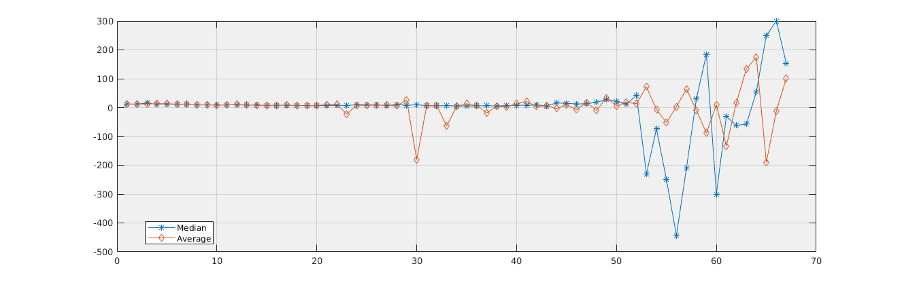
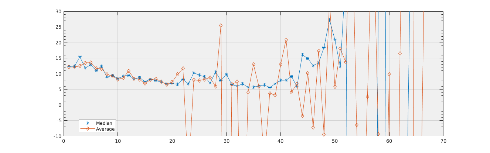
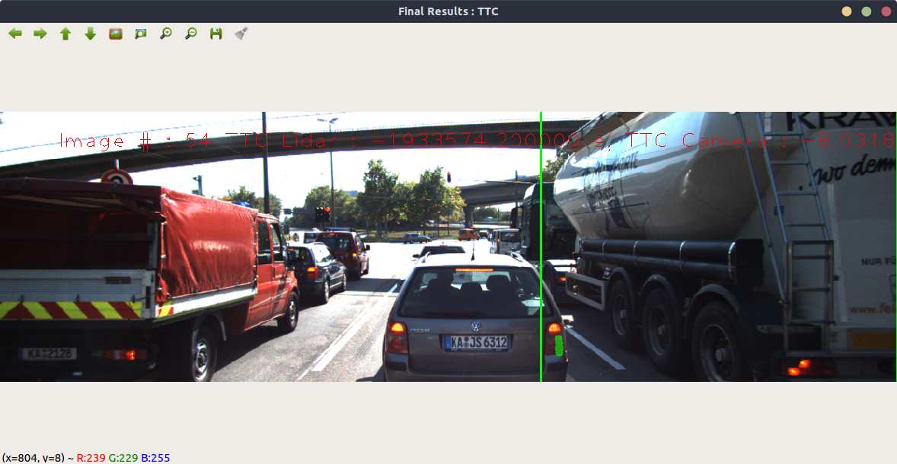
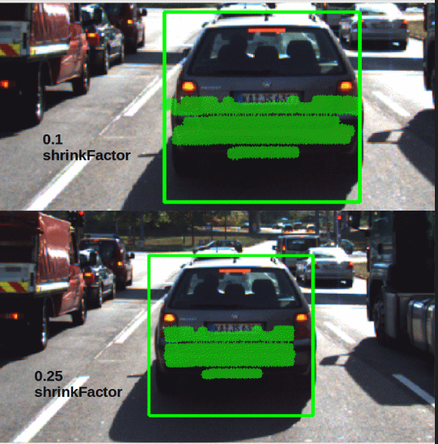
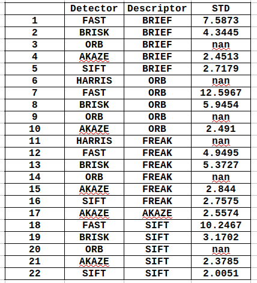
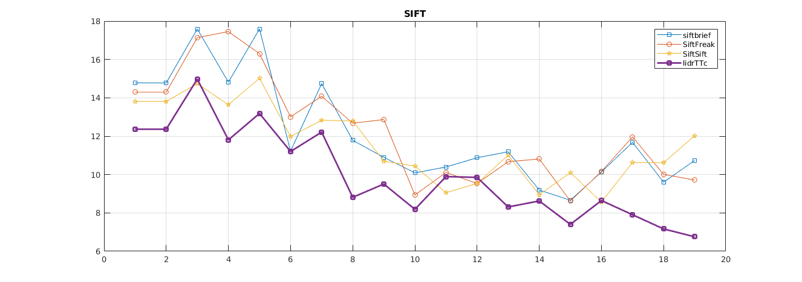
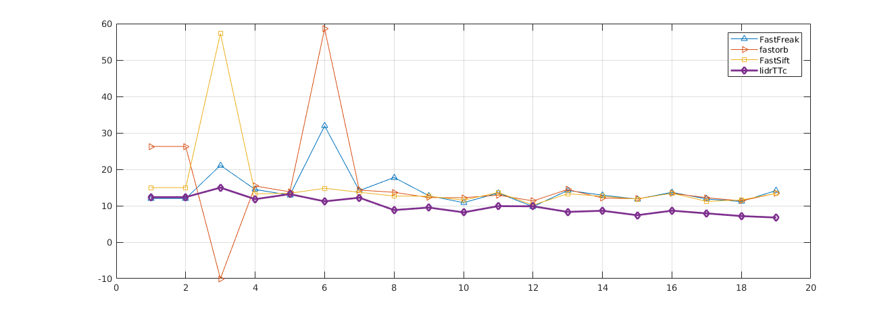
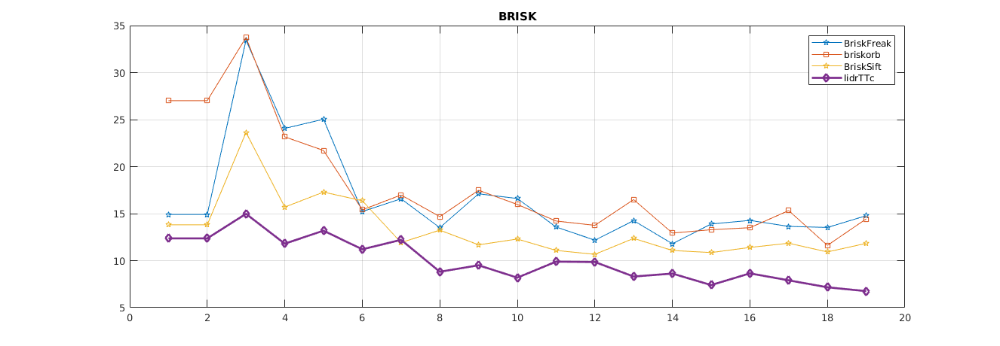
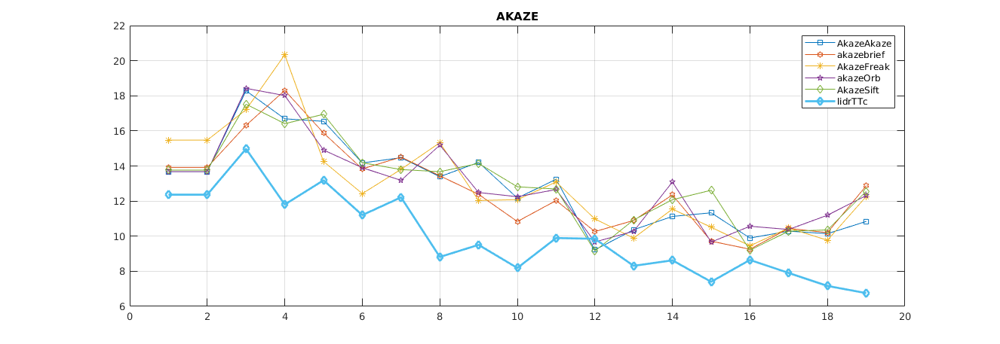

# Final Project Report

## FP.1 Match 3D Objects
I`ve created 2D Array to track number of matched keypoints between each previous bounding box and current bounding box.
The Array shape is (CurrBBoxes, PrevBBoxes).
and at the end of the function i find the index of maximum matched prevbox with currbox. then add the pair to the returned map. 
## FP.2 Compute Lidar-based TTC
TTC computation using Lidar requires identifying a point across two consecutive frames, Then by knowing the time between the two frames and the change in position of the point. We can compute the TTC. 
Lidar collects numerous amount of points, one distinctive point is the closest point to our vehicle in the x axis.
We use this point for our computation. We can make our algorithm robust to outlier by clipping any lidar point lies outside the preceding vehicle bounding box.  
Computing TTc based on the closest points alone introduces some errors because of outliers. 
a TTC based on Average and Median Points X is implemented and the median approach offers the best stable results yet. 

## FP.3 Associate Keypoint Correspondences with Bounding Boxes
By using OpenCv built in function `contains(pt)` we can easily check if the keypoint lies in the respective bounding box. We can also remove the outliers by rejecting any keypoints matches which their distance is bigger than a certain threshold, in our case we used the mean of all keypoints distance as threshold. because all the keypoints are located on the same object. their distance should be the same in the ideal case, otherwise these keypoints are outliers.  

## FP.4 Compute Camera-based TTC
For Camera-based TTC computation we should match 2 keypoints and the calculate the distance between them. In the ideal case the distance between all the keypoints on the preceding vehicle should be equal. But in practice this don't happen. So we can make our computation based on the median of all the computed distance. this will make the algorithm robust in dealing with poor keypoints matching. 
## FP.5 Performance Evaluation 1
Lidar based TTC computation suffers from certain problems. on some frames we get a negative TTC this because the preceding vehicle is moving away from the ego vehicle. also in some frame we get an inf value due to the vehicles are stationary and division by zero is happened in TTC computation.
In the following plots we can notice the two problems. 

In some other frames we can notice a false object detection and the bounding box is alternated between the preceding vehicle and the truck on the right side.
this false detection results in miscalculation of Lidar TTC. 

Also a very important trick is the shrinkfactor to reduce the region of the bounding box. this will reject the points which belong to the road not the preceding vehicle 

## FP.6 Performance Evaluation 2
The Following Table shows Detector / Descriptor combinations and the Standard Deviation of the computed TTC using this combination.

As we can see SIFT/SIFT has the lowest STD which means the most stable readings. some combinations give Inifinty in the TTC so it's STD is nan in the table.

The Following Graphs shows some of the combinations TTC plotted with the Lidar TTC.

# SFND 3D Object Tracking

Welcome to the final project of the camera course. By completing all the lessons, you now have a solid understanding of keypoint detectors, descriptors, and methods to match them between successive images. Also, you know how to detect objects in an image using the YOLO deep-learning framework. And finally, you know how to associate regions in a camera image with Lidar points in 3D space. Let's take a look at our program schematic to see what we already have accomplished and what's still missing.

In this final project, you will implement the missing parts in the schematic. To do this, you will complete four major tasks: 
1. First, you will develop a way to match 3D objects over time by using keypoint correspondences. 
2. Second, you will compute the TTC based on Lidar measurements. 
3. You will then proceed to do the same using the camera, which requires to first associate keypoint matches to regions of interest and then to compute the TTC based on those matches. 
4. And lastly, you will conduct various tests with the framework. Your goal is to identify the most suitable detector/descriptor combination for TTC estimation and also to search for problems that can lead to faulty measurements by the camera or Lidar sensor. In the last course of this Nanodegree, you will learn about the Kalman filter, which is a great way to combine the two independent TTC measurements into an improved version which is much more reliable than a single sensor alone can be. But before we think about such things, let us focus on your final project in the camera course. 

## Dependencies for Running Locally
* cmake >= 2.8
  * All OSes: [click here for installation instructions](https://cmake.org/install/)
* make >= 4.1 (Linux, Mac), 3.81 (Windows)
  * Linux: make is installed by default on most Linux distros
  * Mac: [install Xcode command line tools to get make](https://developer.apple.com/xcode/features/)
  * Windows: [Click here for installation instructions](http://gnuwin32.sourceforge.net/packages/make.htm)
* Git LFS
  * Weight files are handled using [LFS](https://git-lfs.github.com/)
* OpenCV >= 4.1
  * This must be compiled from source using the `-D OPENCV_ENABLE_NONFREE=ON` cmake flag for testing the SIFT and SURF detectors.
  * The OpenCV 4.1.0 source code can be found [here](https://github.com/opencv/opencv/tree/4.1.0)
* gcc/g++ >= 5.4
  * Linux: gcc / g++ is installed by default on most Linux distros
  * Mac: same deal as make - [install Xcode command line tools](https://developer.apple.com/xcode/features/)
  * Windows: recommend using [MinGW](http://www.mingw.org/)

## Basic Build Instructions

1. Clone this repo.
2. Make a build directory in the top level project directory: `mkdir build && cd build`
3. Compile: `cmake .. && make`
4. Run it: `./3D_object_tracking`.
